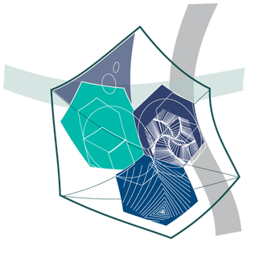

[](https://github.com/harps116/classmate/blob/master/LICENSE)

[](https://github.com/harps116/classmate/issues)

# ClassMate 


## Reddit/HackerNews/StackOverflow clone

## Stack

- Maria DB
- Php 7.0
- JavaScript, CSS, HTML
- Vue
***********************

Table of Contents
=================

  * [Dev Quickstart](#markdown-header-dev-quickstart)
  * [Update DataBase](#markdown-header-update-database)


## Dev Quickstart 

## Docker

Change .env-example to .env change the credentials to what you want.

`docker-compose up -d --build`

Let it build :hourglass_flowing_sand:

setup can be customised from `docker-compose.yaml`

and configured and changed from `./build` directory.

app will be running on locatlhost:8080

phpmyadmin will be running on localhost:8888


## Server Side ( PHP )

> Create a env.php add credentials, see env-example.php for details.

`/config.php`
```
define("DEV_BUILD", true);
```
:headphones: :clapper: [Quickstart Video](https://youtu.be/D2o14PY7Ums)

## Recipe to add functionality
:book:

1. add a file to the `models` folder that queries the database:

    - create a `model` ( if one doesn't exist ) 
      > note that the `model` file names are singular

`/models/user.php`
```
	protected function profile(){
		$viewmodel = new UserModel();
		$this->returnView($viewmodel->profile($_GET["id"]), true);
	}

```
      
2. add a file to the `controllers` that gets the data from the model and then returns the corresponding `viewmodel`:

    - create a `controller`that respresents the data you want to get ( if one doesn't exist ).  
    - add a `method` to the `controller` that will call the corresponding `method` of the `model`.
     > don't forget to require them both in `index.php`
       note controllers are plural

`/controllers/users.php`
```
	public function profile($id){
		// Example only 
		// Add DB logic here

		if($_SESSION['is_logged_in']){
			$sql = 'SELECT * FROM users
					WHERE id = :id';

			$id = intval($id);		
			$this->query($sql);
			$this->bind(':id', $id);
			$row = $this->single();
			return $row;
		}
	}
```

3. add a corresponding `view` folder named after the controller with a file for the `method`. 

    - This holds pages that reflect a method in the `controller`. If the param passed to the controller `returnView` is true the view will be full page and include `main.php` otherwise it will just be the `view`.

     > :warning: !important the view should have the same name as the method in the controller

`/views/users/profile.php`
```
    // Example only
    <?php var_dump($viewmodel); ?>
```

## Front End ( Vue and Axios )

1.  Make sure you have Node.js installed. Then run `npm install` to install all of the modules. Once you have them installed, you can get to work adding components. 

		-To see the changes you're making to the web page, you must run `npm run dev`. 


2.  To add a component to the project, make a file with the extension .vue and add it to the `src/components` folder. Then you'll want to import the component in the `main.js` file and register the child components in `main.js` as well. 

```
		//Example Only
		import QuestionList from "./components/QuestionList.vue"; 
		Vue.component("question-list", QuestionList);

```

		-Then you will also want to add the component to the `new Vue{}` in the components object

3. Once you have those things done, you can start adding your component to the `views` to be displayed on the page

```
	//example from profile.php
	<div id="vue">
    <user-profile :current-user-id = "currentUserId" :cm-data="cmData" :user-data="userData"></user-profile>
	</div>

```
		-You want to make sure that you set the `id` in the div to `vue` or whatever you have your main vue instance set to

#### Tip: `Installing Vue.js devtools for Google Chrome can help you out with troubleshooting your components`

***********************

### Update DataBase

delete your local `final_project` DataBase then run in the SQL console of `localhost/phpmyadmin` in order:

1. contents of `/db-scripts/final_project-latest.php`
2. contents of `/db-scripts/db-patch-latest.php`
3. contents of `/db-scripts/db-seed-latest.php`

### End Quickstart

***********************